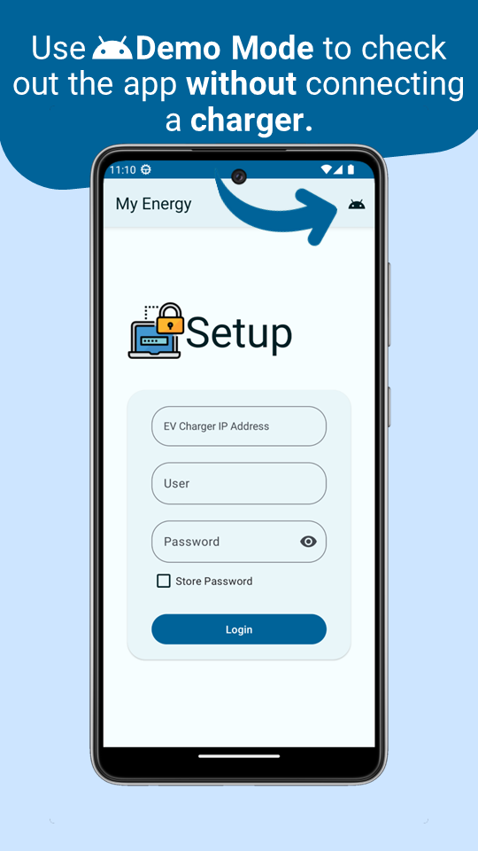
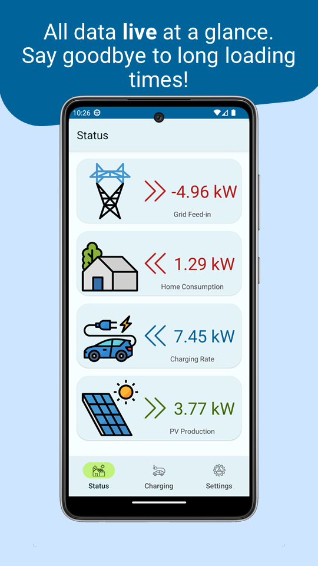
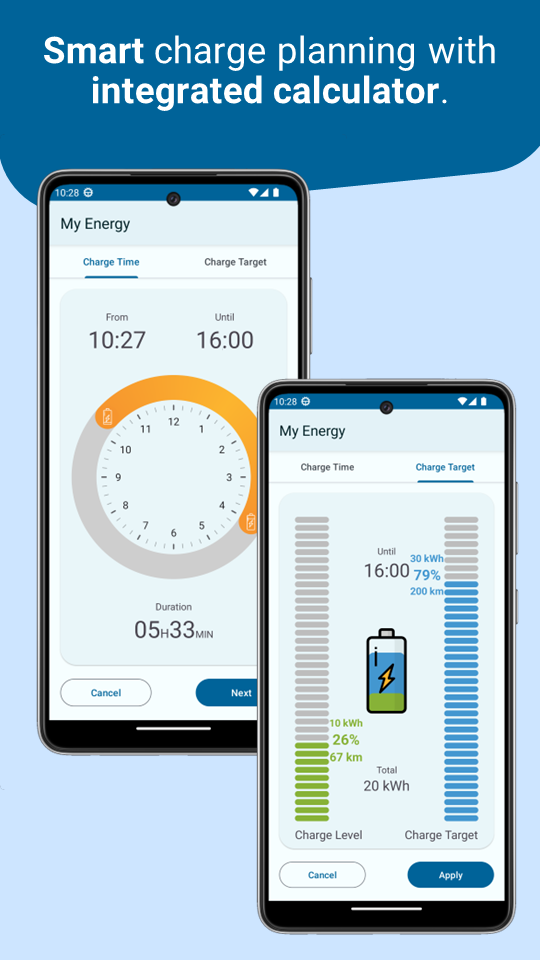
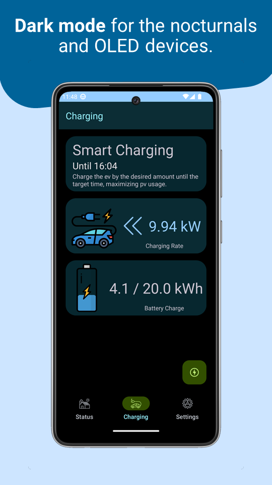

<!--

-->

# MyEnergy

   

[📱 **show all demo images**](demo)

## Project Vision

MyEnergy is an App for monitoring power usage in a Smart Home and controlling electric vehicle (ev) charging.
It serves as an alternative to [SMAs](https://www.sma.de/) proprietary app [SMA Energy](https://play.google.com/store/apps/details?id=de.sma.energy).
Contrary to the original app, it should directly communicate with the ev charger over local area network instead of relying on cloud services.
That way MyEnergy should overcome or minimize the following usability deficiencies of SMA Energy:

* long response times
* display of outdated data
* refreshing of data at low rates

Additionally the app should provide the following features to improve the user experience:

* intuitive calculator for ev charge  
* alert if charging is interrupted _(optional)_  

While still retaining the feature set of SMA Energy, including:

* Status page, displaying current energy consumption
* monitoring and controlling of ev charging
* displaying historic data in graphs _(out of scope)_

The ev charger has an undocumented RestAPI which can be reverse engineered for communication over LAN.  
Inverter and Energy Management could be accessed over [ModbusTCP](https://en.wikipedia.org/wiki/Modbus), using [digitalpetri/modbus](https://github.com/digitalpetri/modbus) library or similar, but the ev charger should expose all needed data.

## Credits

### Assets

* [Material Symbols & Icons](https://fonts.google.com/icons) licensed under [Apache License 2.0](https://github.com/google/material-design-icons/blob/master/LICENSE)
* [Lineal](https://www.flaticon.com/authors/aphiradee/lineal) and [Lineal Color](https://www.flaticon.com/authors/aphiradee/lineal-color) icons by monkik - flaticon

### Libraries

* [Android Jetpack](https://github.com/androidx/androidx) licensed under [Apache License 2.0](https://github.com/androidx/androidx/blob/androidx-main/LICENSE.txt)
* [Material Components for Android](https://github.com/material-components/material-components-android) licensed under [Apache License 2.0](https://github.com/material-components/material-components-android/blob/master/LICENSE)
* [SegmentedVerticalSeekBar](https://github.com/smartSenseSolutions/SegmentedVerticalSeekBarDemo/) licensed under [Apache License 2.0](https://github.com/smartSenseSolutions/SegmentedVerticalSeekBarDemo/blob/main/LICENSE)
* [Floating Action Button Speed Dial](https://github.com/leinardi/FloatingActionButtonSpeedDial) licensed under [Apache License 2.0](https://github.com/leinardi/FloatingActionButtonSpeedDial/blob/release/LICENSE)
* [Armadillo - Encrypted Shared Preference](https://github.com/patrickfav/armadillo) licensed under [Apache License 2.0](https://github.com/patrickfav/armadillo/blob/master/LICENSE)
* [Gson](https://github.com/google/gson/) licensed under [Apache License 2.0](https://github.com/google/gson/blob/master/LICENSE)
* [Retrofit 2](https://github.com/square/retrofit) licensed under [Apache License 2.0](https://github.com/square/retrofit/blob/master/LICENSE.txt)
* [OkHttp](https://github.com/square/okhttp) licensed under [Apache License 2.0](https://github.com/square/okhttp/blob/master/LICENSE.txt)
* [AndroidX Preference eXtended](https://github.com/takisoft/preferencex-android) licensed under [Apache License 2.0](https://github.com/takisoft/preferencex-android/blob/master/LICENSE)
* [junit4](https://github.com/junit-team/junit4) licensed under [Eclipse Public License 1.0](https://github.com/junit-team/junit4/blob/main/LICENSE-junit.txt)
* [TimeRangePicker](https://github.com/Droppers/TimeRangePicker) licensed under [MIT license](https://github.com/Droppers/TimeRangePicker/blob/main/LICENSE)

## Charging demo

<https://user-images.githubusercontent.com/17405009/212706638-0cdc4317-3033-4e24-82e8-ff1d6afe8080.mp4>

